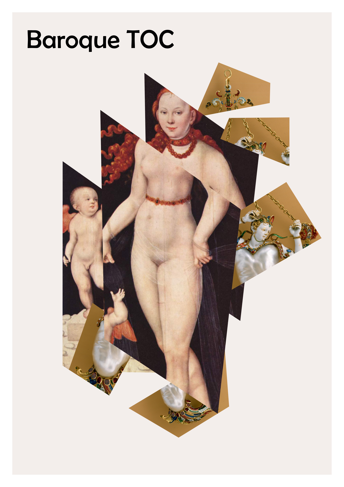

## Automating Exhibition Catalogue Creation - A Guide

Read online here: [web](https://nfdi4culture.github.io/automating-exhibition-catalogue-creation-guide/)

2023-03-28 v1.1

Prototype series: Baroque TOC

Coordinated by Simon Worthington - NFDI4Culture @Open Science Lab, TIB, Hannover

March-April 2023

Venus und Cupido, Heinrich Bollandt, between circa 1620 and circa 1630. https://commons.wikimedia.org/wiki/File:Heinrich_Bollandt_-_Venus_und_Cupido.jpg This work is in the public domain.

### Cite as 

Document DOI:  | Author: Simon Worthington https://orcid.org/0000-0002-8579-9717 

 This work is licensed under a <a rel="license" href="http://creativecommons.org/licenses/by-sa/4.0/">Creative Commons Attribution-ShareAlike 4.0 International License</a>.
